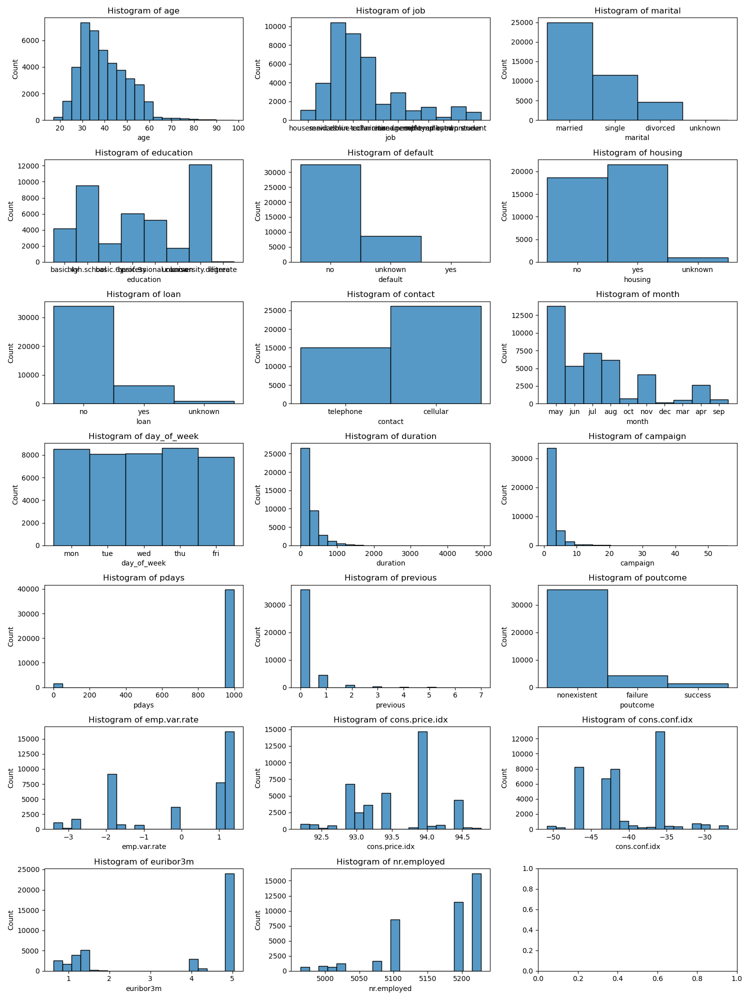
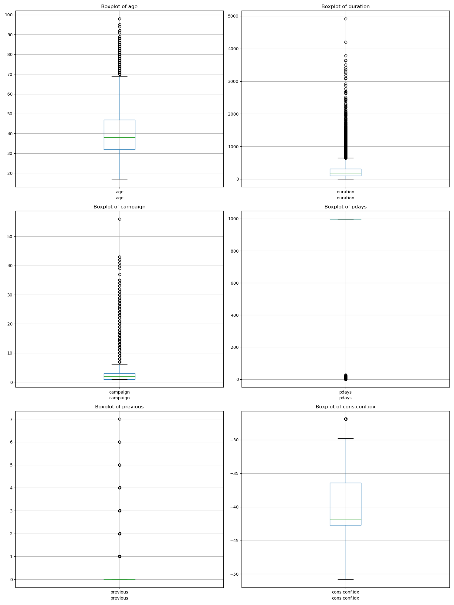
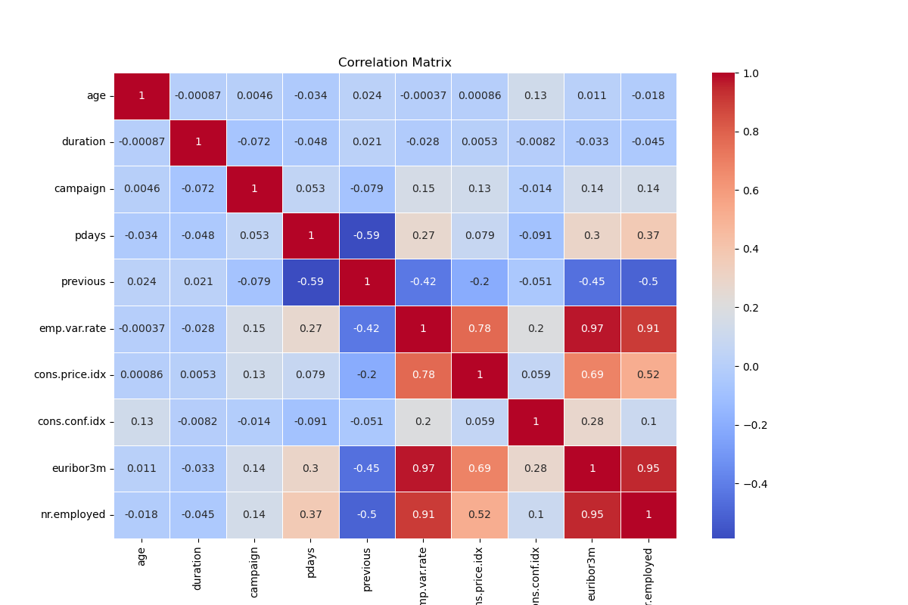
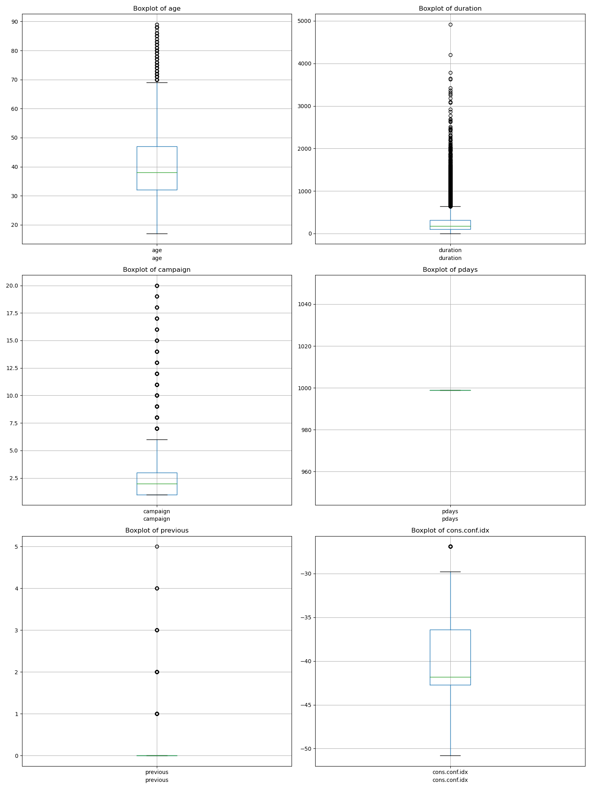
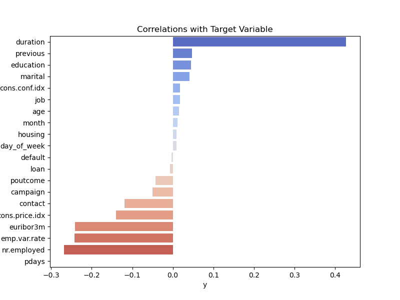
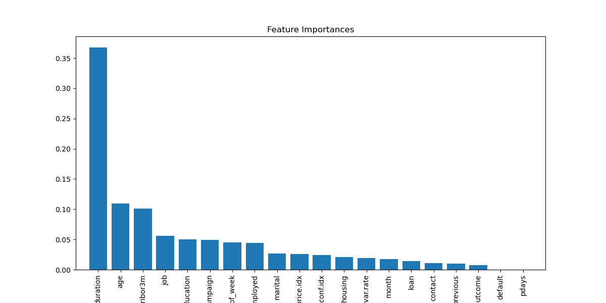
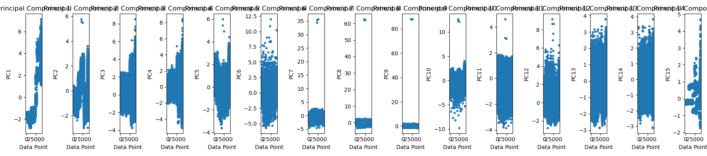
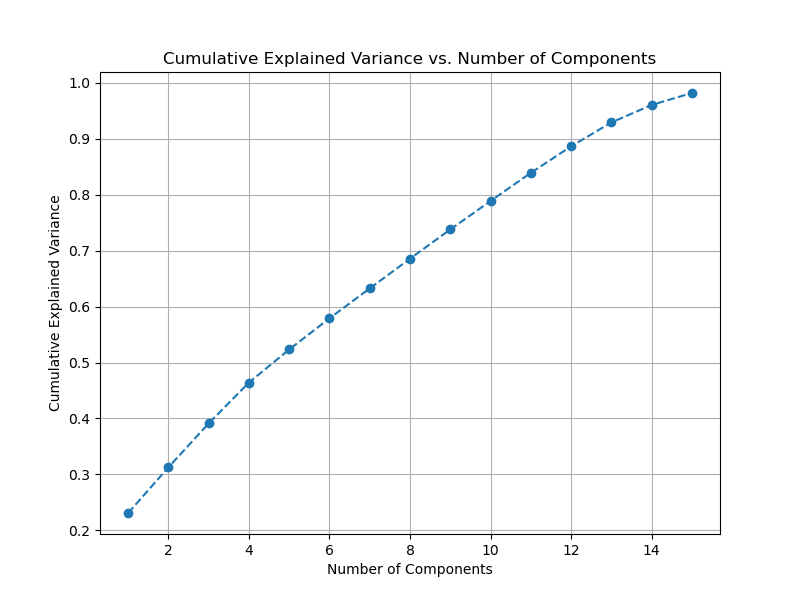

# Predict if the client will subscribe a term deposit

This data study examines a vehicle dataset and derives the features that influence the price of a car

## Description

The data is related with direct marketing campaigns (phone calls) of a Portuguese banking institution. The classification goal is to predict if the client will subscribe a term deposit.

## Scope

The classification goal is to predict if the client will subscribe (yes/no) a term deposit.?

## Getting Started

The objective of this assingment is find the variables that will predict if the client will subscribe (yes/no) a term deposit and recommendation models.

### Dependencies

* Juypyter note book.

### Analysis

Every model adheres to the fundamental principles of the CRISP-DM Framework, encompassing five key pillars

* Business understanding
* Data understanding
* Data preparation
* Modeling
* Evaluation

#### Data Exploration

As part of data exploration, the following activities have been undertaken:
* Checking for Missing Values
* Checking for Zero Values
* Checking for Unique Values
* Check Deuplicate values
  
#### Data visualziation
* Explored data visually for various features using histograms
   
* Plot outliers
  
* Finding corelations
  
  
#### Data Preparation
##### Data Cleaning
* As part of data cleaning, the following activities have been carried out:
* Remove Duplicate Values
* Remove outliers
* Filter based on thresholds
* Plot outliers after cleaning data
  

##### Data Encoding 
The following encoding techniques were applied to the categorical variables:
* Binay Encoding
* Label Encoding Encoding
      
##### Data Correlation          
* Calculating Feature Correlations

0 (('emp.var.rate', 'euribor3m'), 0.9747016168501773)
1 (('euribor3m', 'nr.employed'), 0.947954857074195)
2 (('previous', 'poutcome'), 0.9380933891860919)
3 (('emp.var.rate', 'nr.employed'), 0.9196944078763364)
4 (('emp.var.rate', 'cons.price.idx'), 0.7957839485861186)
5 (('cons.price.idx', 'euribor3m'), 0.7253712869829044)
6 (('contact', 'cons.price.idx'), 0.6100367646353445)
7 (('cons.price.idx', 'nr.employed'), 0.5837407346580578)
8 (('duration', 'y'), 0.4267632127208427)
9 (('poutcome', 'euribor3m'), 0.4120209335337665)
10 (('poutcome', 'emp.var.rate'), 0.4064869078392068)
11 (('previous', 'euribor3m'), 0.4008161950959643)
12 (('previous', 'nr.employed'), 0.3967155323529069)
13 (('contact', 'euribor3m'), 0.3876599980291771)
14 (('previous', 'emp.var.rate'), 0.38765910391321867)
15 (('poutcome', 'nr.employed'), 0.3870882083890002)
16 (('age', 'marital'), 0.38329128607145935)
17 (('contact', 'emp.var.rate'), 0.3818986525119886)
18 (('cons.conf.idx', 'euribor3m'), 0.3421888268614838)
19 (('contact', 'month'), 0.3293239970130101)

* Visualizing the Correlation Matrix
  
  
* Identifying the Top 20 Features with Positive and Negative Correlations
  
  ** Top 10 positive correlated unique features:
	['y', 'emp.var.rate', 'duration', 'nr.employed', 'previous', 'contact', 'cons.price.idx', 'euribor3m', 'poutcome']

  ** Top 10 negative correlated unique features:
	['loan', 'duration', 'emp.var.rate', 'age', 'day_of_week', 'month', 'housing', 'poutcome', 'cons.conf.idx', 'job', 'euribor3m']
  
##### Feature Selection
An attempt was made to identify the relevant features using the following models.
* RandomForestRegressor 
duration: 0.3675454292004441
age: 0.10983283300055438
euribor3m: 0.1013542216734454
job: 0.056128417750817505
education: 0.0497713783290971
campaign: 0.04900327539989634
day_of_week: 0.045286685301516284
nr.employed: 0.04398382864143474
marital: 0.027014141951066432
cons.price.idx: 0.025894502545232213
cons.conf.idx: 0.02388384351173763
housing: 0.021268580879660777
emp.var.rate: 0.019377477580753057
month: 0.017351179249017256
loan: 0.014375634527476203
contact: 0.0109775861948155
previous: 0.009788585155271071
poutcome: 0.007162380871569835
default: 1.823619413093103e-08
pdays: 0.0
   
  
##### PCA   
* PCA analysis was conducted on the data set.Here are the results
Explained Variance Ratios: [0.23089407 0.08173341 0.07852996 0.07309128 0.05912237 0.05567743
 0.05350809 0.05308467 0.05229882 0.05089786 0.05034266 0.0473635
 0.04274539 0.03128743 0.02146626]
 
   
   

##### Modeling
* Creating datasets for modeling
* Model-Iteration 1 (With selected features from corelation)
	* LogisticRegression
	* Decision Tree Classifier
	* KNeighbors Classifier
    * Results for various classifiers
                 Model  Accuracy  Precision    Recall  F1 Score
0  Logistic Regression  0.907112   0.000000  0.000000  0.000000
1        Decision Tree  0.905720   0.412698  0.035422  0.065245
2                  KNN  0.901164   0.405622  0.137602  0.205493
3                  SVM  0.907112   0.000000  0.000000  0.000000
* Model-Iteration 2: ((With all features from PCA data set)
	* LogisticRegression
	* Decision Tree Classifier
	* KNeighbors Classifier
    * Results for various classifiers
                 Model  Accuracy  Precision    Recall  F1 Score
0  Logistic Regression  0.914325   0.585075  0.267030  0.366698
1        Decision Tree  0.904708   0.478842  0.292916  0.363483
2                  KNN  0.910656   0.537037  0.276567  0.365108
3                  SVM  0.907112   0.000000  0.000000  0.000000
  
##### Deployment

## Summary of Classification Models for Term Deposit Subscription

Background:
The objective is to create a predictive model to determine whether a client will subscribe to a term deposit, with the binary target variable "y" representing subscription outcomes.

## Models Evaluated:

### Logistic Regression:

Accuracy: 91.43%
Precision: 58.51%
Recall: 26.70%
F1 Score: 36.67%

<b>Summary:</b> Logistic Regression achieved the highest accuracy and precision among the models, making it the best choice for minimizing false positives. However, the recall is relatively low, indicating that it might miss some potential subscribers. Despite this, it provides a reasonable balance between precision and recall, making it suitable for the task.

### Decision Tree:

Accuracy: 90.47%
Precision: 47.88%
Recall: 29.29%
F1 Score: 36.35%

<b>Summary:</b> The Decision Tree model has a lower accuracy and precision than Logistic Regression. It offers slightly better recall but still falls short in achieving a well-balanced F1 Score.

### K-Nearest Neighbors (KNN):

Accuracy: 91.07%
Precision: 53.70%
Recall: 27.66%
F1 Score: 36.51%

<b>Summary:</b> KNN provides accuracy and precision close to Logistic Regression. However, it has a lower recall, which means it may also miss some potential subscribers. Like the Decision Tree, it offers a reasonably balanced F1 Score.

### Support Vector Machine (SVM):

Accuracy: 90.71%
Precision: 0.00%
Recall: 0.00%
F1 Score: 0.00%

<b>Summary:</b> SVM achieved the lowest results in all metrics. It has a precision and recall of zero, indicating that it didn't predict any subscribers. It's not a recommended model for this specific task.

#### Recommendations

Based on the provided results and considering the trade-off between precision and recall, the Logistic Regression model is recommended for this classification task. It offers the highest precision, meaning fewer false positive predictions, and an acceptable balance with recall, which is essential for identifying subscribers. However, the choice of model should also consider specific business objectives, computational efficiency, and interpretability.

## Next Steps and Recommendations

#### Utilize Logistic Regression:

I recommend using the Logistic Regression model as it has demonstrated the highest accuracy and well-balanced precision and recall, making it suitable for our classification task.

#### Feature Engineering:

Conduct a more in-depth analysis of feature importance. Select and engineer features to potentially enhance model performance.

#### Hyperparameter Tuning:

Fine-tune the hyperparameters of the Logistic Regression model using grid search or random search. Optimizing hyperparameters can further improve model accuracy.

#### Cross-Validation:

Implement k-fold cross-validation to ensure that the model's performance is consistent across different data subsets. This helps assess its robustness and generalization capabilities.

#### Address Class Imbalance:

In the case of a significant class imbalance, consider applying techniques like oversampling or undersampling to mitigate the imbalance and improve the model's handling of minority classes.

#### Model Evaluation Metrics:

Evaluate the model using additional metrics such as ROC AUC, confusion matrix, and learning curves to gain a comprehensive understanding of its performance.

## Link to notebook

https://github.com/priyatamv/ML-Application-1/blob/main/prompt_II.ipynb

## Authors

Priyatam Veyyakula

## Version History

* 0.1
    * Initial Release

